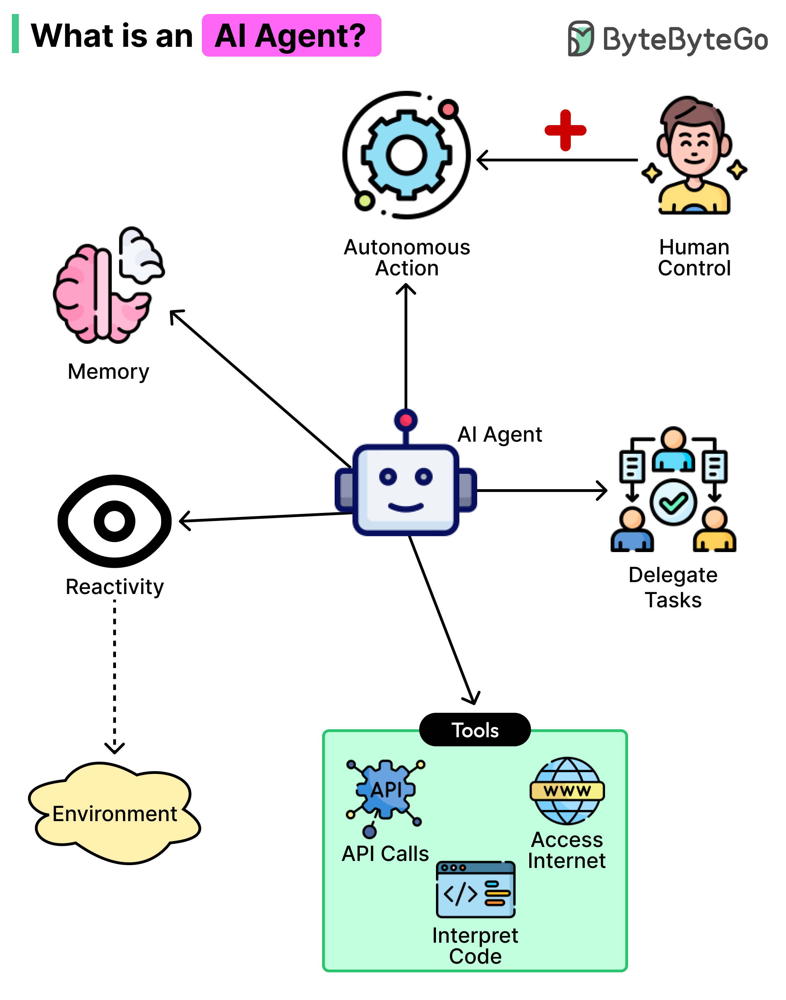
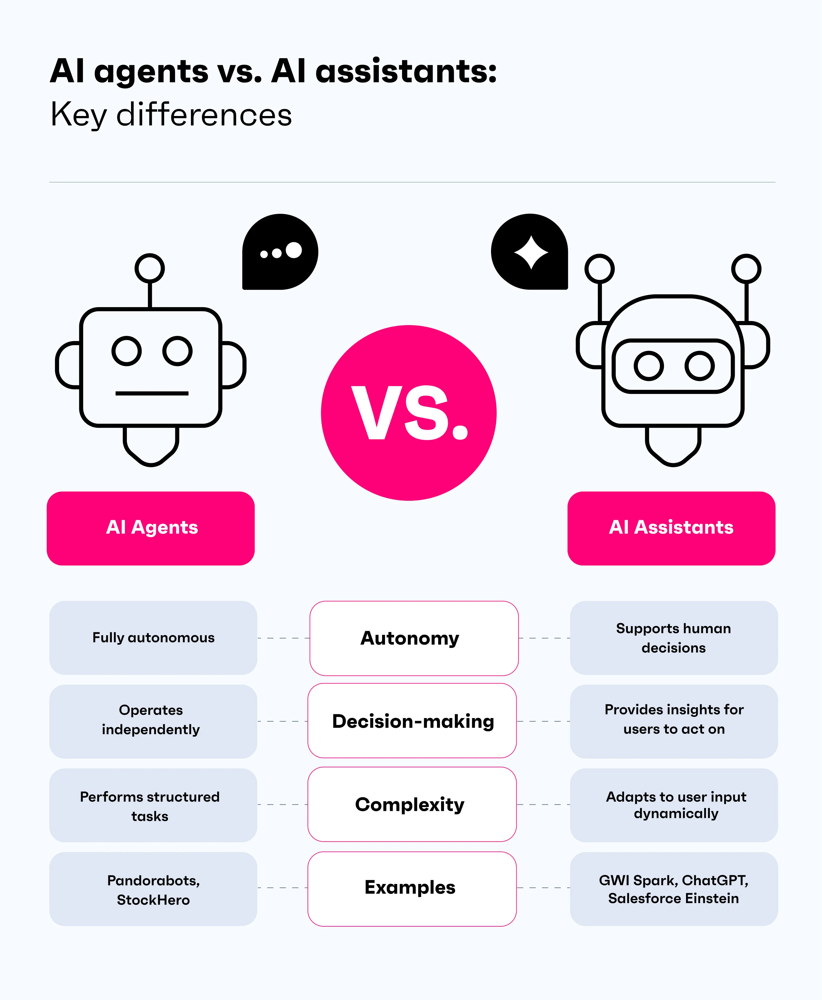

# Introducción a Agentes en AI Engineering

En este módulo aparece el patrón **agente**.

> **Agente** = sistema que, ante un pedido, ejecuta **varios pasos** de razonamiento, **actualiza un estado** y **para** cuando cumple el objetivo o un límite.

Sirve para tareas que no se resuelven bien con una sola llamada al modelo: hay que descomponer, recordar lo ya decidido y decidir el siguiente paso.

Para situarnos con lo visto hasta ahora:

- El **RAG** encaja cuando basta recuperar evidencia y generar **una** respuesta desde la base vectorial.
- El **agente** encaja cuando el pedido es una **tarea** más larga (preferencias → propuestas → plan).
- Un agente puede **decidir** si usa tools: por ejemplo consultar el corpus (RAG), aclarar preferencias sin buscar, o llamar a una API.
- Empezaremos por el **ciclo** (paso → actualizar → ¿seguir o parar?) y la **idea de estado**. Las tools llegan más adelante.

---

## LLM, chatbot, asistente, RAG y agente

Ponemos una tabla compartivia entre los diferentes patrones de trabajo que hemos visto hasta ahora para poder compararlos y entender mejor su funcionamiento.

| Concepto | Qué hace | ¿Estado de tarea? | ¿Varios pasos? | Ejemplo genérico |
|----------|----------|-------------------|----------------|------------------|
| **LLM** | Modelo que genera o completa texto | Solo lo que recibe en el prompt | No por sí solo | Responder una pregunta abierta en una llamada |
| **Chatbot** | Conversación turno a turno | Historial de mensajes | No planifica una tarea | Chat de atención al cliente con hilo de diálogo |
| **Asistente** | Ayuda al usuario con un rol / instrucciones fijas | A veces (perfil, contexto del hilo) | Suele ser 1 respuesta por turno | “Redáctame un email con este tono” |
| **Pipeline RAG** | Recupera fragmentos de un corpus y genera **una** respuesta | No de ejecución multi-paso | Flujo fijo (recuperar → generar) | “Según el manual, ¿cuál es el plazo de devolución?” |
| **Agente** | Razona, actualiza un estado y decide si seguir o parar | **Sí** | **Sí** (loop + parada) | “Organízame un plan de tarde según mis preferencias” |

Un chat con historial **no** es automáticamente un agente: si cada mensaje dispara una sola pasada fija (por ejemplo un RAG), no hay un objeto “dónde voy en la tarea” que el sistema actualice paso a paso. Eso no es un defecto: el RAG de una sola pasada es el diseño correcto cuando solo hace falta *consultar el corpus*.

### ¿Cuándo aporta un agente?

Si la tarea se descompone en subtareas, necesita recordar decisiones intermedias o (más adelante) coordinar varias tools.

**No aporta un agente** (mejor RAG o un prompt simple), si la pregunta se responde con evidencia en un turno, no hay plan que construir, o el loop solo añade latencia y coste.

| Pedido | Mejor enfoque |
|--------|----------------|
| “Según la documentación, ¿qué significa este campo?” | RAG |
| Pregunta fuera del corpus / sin evidencia | RAG + abstenerse (no inventar) |
| “Arma un plan de tarde: cine o música, 3 h, zona centro” | **Agente** |
| “Hola, ¿qué tal?” | Chatbot / saludo |

En resumen: **agente ≠ LLM con personalidad**, **≠ chatbot con historial**, **≠ RAG** (el RAG puede ser *una tool* del agente más adelante).

---

## Objetivos del bloque

Al terminar, deberías poder:

- Distinguir LLM, chatbot, asistente, pipeline RAG y agente.
- Dibujar la arquitectura mínima de un agente.
- Explicar la diferencia entre **una llamada a un LLM** y un **loop** multi-paso.
- Decidir cuándo aporta valor utilizar un agente.
