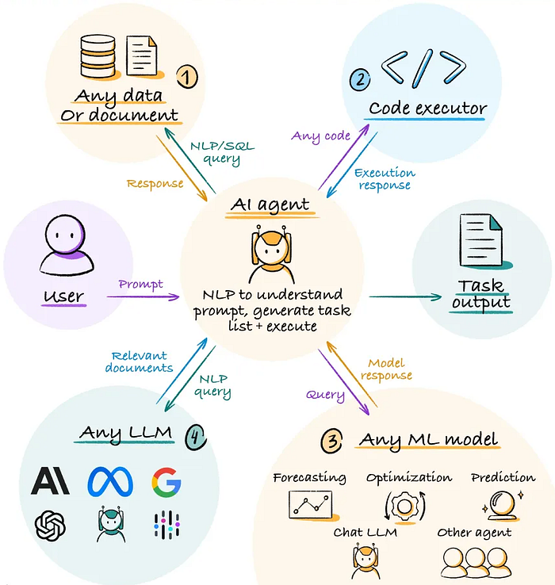

# Arquitectura y ciclo de ejecución

Vamos a entender la arquitectura software mínima de un **agente de IA** sin entrar en frameworks: **cinco piezas** y un **bucle**. Luego contrastamos ese ciclo multi-paso con una sola pasada (one-shot).



---

## Arquitectura software mínima

```text
┌─────────────┐
│   Entrada   │  pedido del usuario (preferencias, objetivo). Recibir la entrada del usuario.
└──────┬──────┘
       ▼
┌─────────────┐
│     LLM     │  propone el siguiente paso / actualiza el plan.
└──────┬──────┘
       ▼
┌─────────────┐
│   Estado    │  “dónde vamos”. Guardar la información que vamos recopilando.
└──────┬──────┘
       ▼
┌─────────────┐
│  Decisión   │  ¿seguir o parar? Decidir si seguimos o paramos el proceso.
└──────┬──────┘
       ▼
┌─────────────┐
│   Salida    │  plan final / mensaje al usuario / error. Devolver el resultado de la tarea.
└─────────────┘
```

| Pieza | Rol |
|-------|-----|
| **Entrada** | Texto o datos del pedido (p. ej. intereses, tiempo, zona) |
| **LLM** | Dado el estado, propone qué hacer ahora |
| **Estado** | Estructura que crece en cada iteración |
| **Decisión** | Seguir, marcar fin (`done`), o parar por límite / error |
| **Salida** | Resultado para el usuario (y, si aplica, traza de pasos) |

---

## El bucle (ciclo de ejecución)

```text
estado = inicial(pedido)
mientras no parado:
    propuesta = LLM(estado)
    estado = actualizar(estado, propuesta)
    si objetivo_cumplido o límite:
        parado = True
devolver estado
```

Idea en Python:

```python
def run_agent(pedido):
    estado = inicial(pedido)
    while not parado:
        propuesta = LLM(estado)
        estado = actualizar(estado, propuesta)
        if objetivo_cumplido or límite:
            parado = True
    return estado
```

En el código del sprint (Bloque 3 / Live Review) esa idea se concreta en **`procesar_turno(estado, mensaje)`** (un turno) y, en la demo CLI, **`run_demo`** con `max_turns`. El nombre `run_agent` aquí es solo el esquema mental.

---

## One-shot vs multi-paso

**One-shot** (una sola pasada, típico de un pipeline RAG):

```text
entrada ──► [ pipeline fijo ] ──► salida
                 │
                 └── recuperar → prompt → generar
```

- Una ejecución por pregunta.
- Ideal cuando basta consultar el corpus y responder.

**Multi-paso** (agente):

```text
entrada ──► paso 1 ──► paso 2 ──► … ──► parada ──► salida
              │          │
              └─ LLM ────┴─ actualiza borrador / preferencias / estado
```

Ejemplo de pedido:

> “Quiero una tarde cultural de unas 3 horas: prefiero algo gratuito o barato, me gusta el cine y si no hay, música en vivo. Zona centro si puede ser.”

Un agente razonable podría:

1. Extraer preferencias del texto.
2. Proponer 2–3 ideas alineadas.
3. Ordenar un mini-itinerario.
4. Redactar el plan final y marcar que ha terminado.

Cada paso **usa** lo anterior: por eso hace falta estado.

Versión naive para practicar (sin estado formal todavía):

```python
pedido = "..."
borrador = ""
for paso in range(1, N + 1):
    texto = llamar_llm(f"Paso {paso}/{N}. Pedido: {pedido}. Hasta ahora: {borrador}")
    print(paso, texto)
    borrador = texto  # luego será un estado estructurado
```

---

## ¿Cuándo usar multi-paso?

**Sí**, si el usuario pide un plan o una secuencia, o hace falta descomponer antes de responder.

**No**, si basta una consulta al corpus, un solo turno de chat sin tarea, o el loop no aporta nada (solo coste).

Cada iteración consume tokens y tiempo. Más adelante verás límites (`max_turns`), condiciones de parada y traza: sin eso, el agente “funciona en la demo” y falla cuando el modelo se enrolla.

---

## Qué queda para más adelante

| Capacidad | Momento |
|-----------|---------|
| Tools / function calling | Más adelante en el módulo |
| RAG como tool | Más adelante en el módulo |
| Frameworks tipo LangGraph | Panorama breve; práctica después |
| HITL / guardrails fuertes | Más adelante en el módulo |

---

## Para llevarte

Un agente de IA, en lo esencial, es: **loop + estado + parada + LLM**. El resto son capas.
