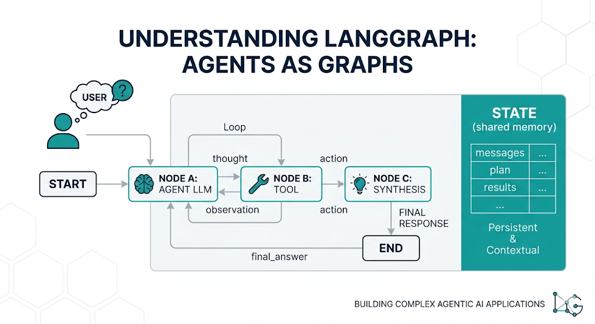
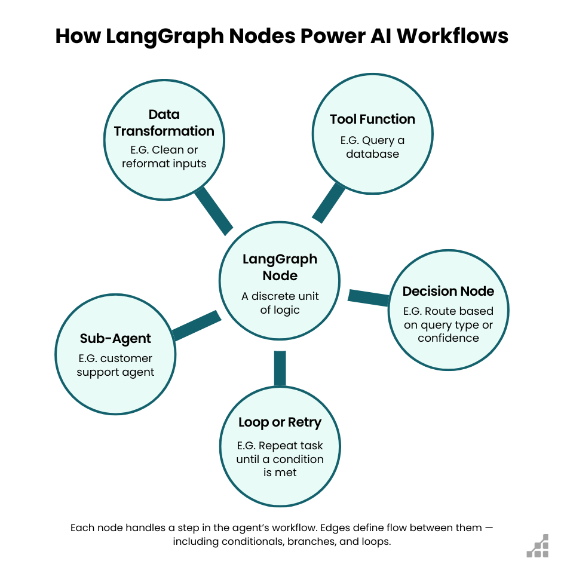

# Panorama LangGraph

En este sprint generamos agentes **escribiendo el loop en Python**: estado, actualización, parada (`done`, `max_turns`), traza. Ese enfoque se mantiene: es la base para entender qué orquesta cualquier framework.

Más adelante **ahondaremos en el ecosistema LangGraph** para montar agentes con grafos. Aquí el objetivo es llevarnos una **idea completa del entorno**: qué es, cómo se monta mentalmente, qué piezas existen y dónde leer más.

> LangGraph **no sustituye** diseñar buen estado y buenas paradas: las hace más explícitas.

---

## Qué es LangGraph


[LangGraph](https://langchain-ai.github.io/langgraph/) es una librería del ecosistema LangChain para orquestar aplicaciones con LLMs como **grafos de estado**:

- cada **nodo** es un paso (llamar al modelo, ejecutar una tool, actualizar memoria, pedir OK a un humano…);
- cada **arista** decide el siguiente paso;
- un **estado compartido** atraviesa todo el grafo.

Se usa cuando el flujo deja de ser “una llamada al modelo” y pasa a ser un **proceso** con ramas, bucles y control.





No es “el agente” en sí: es el **orquestador**. El diseño de la tarea (qué guardamos en el estado, cuándo paramos) sigue siendo nuestro.

| Leer más | URL |
|----------|-----|
| Home / docs | https://langchain-ai.github.io/langgraph/ |
| Overview | https://docs.langchain.com/oss/python/langgraph/overview |
| Why LangGraph | https://langchain-ai.github.io/langgraph/concepts/why-langgraph/ |

---

## De nuestro bucle `while` al grafo de LangGraph para actualizar el estado

Lo que ya hacemos en Python:

```text
mensaje → LLM → actualizar estado → ¿seguir o parar?
```

Con vocabulario LangGraph:

| Idea en Python (ahora) | Concepto LangGraph |
|------------------------|--------------------|
| Dict de tarea (`AgentState`) | **State** |
| Una función del ciclo | **Node** |
| `if` / `break` / “siguiente mensaje” | **Edge** (a menudo **condicional**) |
| El bucle completo | **Graph** |
| Entrada / salida controlada | **START** / **END** |

```text
[START]
   │
   ▼
[nodo: razonar / actuar]
   │
   ├── ¿objetivo cumplido o límite? ──► [END]
   │
   └── ¿hace falta otro paso? ──► (vuelve a un nodo)
```

Misma lógica de agente; el grafo lo hace **legible y componible** cuando crecen pasos y ramas.

| Leer más | URL |
|----------|-----|
| Concepts (mapa) | https://langchain-ai.github.io/langgraph/concepts/ |
| Application structure | https://langchain-ai.github.io/langgraph/concepts/application_structure/ |

---

## Anatomía mínima para montar un grafo de LangGraph

Cuando más adelante montemos algo en LangGraph, el orden habitual es:

1. **Definir el State** — qué campos viajan entre nodos (preferencias, mensajes, plan, flags…).
2. **Crear un `StateGraph`** — el contenedor del flujo.
3. **`add_node`** — cada paso es una función Python que recibe estado y devuelve actualización.
4. **`add_edge` / edges condicionales** — cablear el orden y las ramas.
5. **`compile`** — congela el grafo (opcional: checkpointer, límites).
6. **`invoke` o `stream`** — ejecutar una corrida con un input inicial.

```text
State → StateGraph → nodes → edges → compile → invoke / stream
```

No hace falta memorizar la API ahora; sí el **orden**. Así, al abrir un tutorial, sabemos en qué capa estamos.

| Leer más | URL |
|----------|-----|
| Quickstart | https://langchain-ai.github.io/langgraph/agents/agents/ |
| Tutorial introducción | https://langchain-ai.github.io/langgraph/tutorials/introduction/ |
| Graph API | https://langchain-ai.github.io/langgraph/concepts/low_level/ |
| `invoke` / run a graph | https://langchain-ai.github.io/langgraph/how-tos/ |

---

## Ciclo de vida de una ejecución

Qué ocurre en una ejecución típica:

```text
1. Entramos con un input (pedido / mensaje / estado inicial)
2. El runtime visita el nodo actual
3. El nodo lee el State y escribe un patch (actualización)
4. Una arista elige el siguiente nodo (fija o según el estado)
5. Se repite 2–4 hasta END (o interrupt / límite)
6. Obtenemos el State final (y, si hay streaming, eventos por el camino)
```

Nuestro `procesar_turno` es, en la práctica, **un paso** de ese ciclo. Un grafo encadena varios pasos (y ramas) con el mismo State.

| Leer más | URL |
|----------|-----|
| Persistence / execution | https://langchain-ai.github.io/langgraph/concepts/persistence/ |
| Streaming | https://langchain-ai.github.io/langgraph/how-tos/streaming/ |

---

## Tipos de aristas (edges)

| Tipo | Idea | Ejemplo mental |
|------|------|----------------|
| **Fija** | Siempre A → B | Tras “actualizar” siempre “decidir fin” |
| **Condicional** | Según el State (o la salida del nodo) | ¿Hay tool call? → tools; si no → END |
| **Bucle** | Condicional que vuelve atrás | tools → otra vez al modelo |

```text
[modelo]
   │
   ├── tool_calls? sí ──► [tools] ──► [modelo]
   │
   └── no ──► [actualizar / cerrar] ──► [END]
```

Ese diagrama es el corazón de muchos agentes con tools en la doc de LangGraph.

| Leer más | URL |
|----------|-----|
| Edges / branching | https://langchain-ai.github.io/langgraph/concepts/low_level/#edges |
| Tool calling how-to | https://langchain-ai.github.io/langgraph/how-tos/tool-calling/ |
| ReAct / agent style | https://langchain-ai.github.io/langgraph/tutorials/ |

---

## Estado y reducers (cómo se fusiona)

En nuestro código solemos **copiar el dict** y pisar campos (`actualizar_estado`). En LangGraph el State puede declarar **reducers**: reglas de fusión.

- Algunos campos se **reemplazan** (p. ej. `plan` nuevo).
- Otros se **acumulan** (p. ej. lista de mensajes o de pasos de traza → *append*).

Sin esa idea, un tutorial “con `messages`” parece magia: el reducer decide cómo se juntan actualizaciones de varios nodos.

| Leer más | URL |
|----------|-----|
| State / reducers | https://langchain-ai.github.io/langgraph/concepts/low_level/#reducers |
| Update state behaviors | https://langchain-ai.github.io/langgraph/how-tos/ |

---

## Qué aporta el ecosistema

### 1. Control de flujo explícito

Ramas, bucles y salidas a END dibujadas, no escondidas en un `while` de 200 líneas.

### 2. Estado como ciudadano de primera clase

El State es la fuente de verdad entre nodos. Encaja con: historial de chat **pinta**; estado **dirige**.

### 3. Tools y ciclos agente ↔ herramienta

Nodo modelo ↔ nodo tools con edge condicional hasta respuesta final o límite.

| Leer más | URL |
|----------|-----|
| Tools concept | https://langchain-ai.github.io/langgraph/concepts/tools/ |

### 4. Human-in-the-loop (HITL)

**Pausar** el grafo hasta que un humano apruebe, edite o rechace. Útil en pasos sensibles.

| Leer más | URL |
|----------|-----|
| Interrupts / HITL | https://langchain-ai.github.io/langgraph/concepts/human_in_the_loop/ |
| How-to HITL | https://langchain-ai.github.io/langgraph/how-tos/human_in_the_loop/ |

### 5. Persistencia y reanudación (checkpoints)

Guardamos el progreso de una corrida. Ejemplo narrativo: el grafo para en “aprobar plan” → al día siguiente, mismo `thread_id` → continúa desde el checkpoint. Eso va más allá de una `traza` en RAM.

| Leer más | URL |
|----------|-----|
| Persistence | https://langchain-ai.github.io/langgraph/concepts/persistence/ |
| Memory | https://langchain-ai.github.io/langgraph/how-tos/memory/ |

### 6. Streaming

Podemos emitir tokens del modelo o **eventos por nodo** (“entré en tools”, “actualicé plan”). Importante para UIs de chat.

| Leer más | URL |
|----------|-----|
| Streaming | https://langchain-ai.github.io/langgraph/how-tos/streaming/ |

### 7. Composición y multi-agente

Subgrafos o varios roles que se pasan el State (investigador → redactor → revisor). Avanzado; no es el punto de partida.

| Leer más | URL |
|----------|-----|
| Multi-agent | https://langchain-ai.github.io/langgraph/concepts/multi_agent/ |
| Subgraphs | https://langchain-ai.github.io/langgraph/concepts/subgraphs/ |

### 8. Observabilidad y jerga de industria

*StateGraph*, *nodes*, *edges*, *interrupt*, *checkpointer*, *thread_id*… Nos permite leer demos y ofertas sin traducir todo a nuestro `while`.

| Leer más | URL |
|----------|-----|
| LangSmith (trazas del ecosistema) | https://docs.smith.langchain.com/ |

---

## Prebuilt vs grafo a mano

| Enfoque | Qué es | Cuándo |
|---------|--------|--------|
| **Prebuilt / agentes listos** | Plantillas del ecosistema (agente con tools “de fábrica”) | Prototipar rápido, seguir un tutorial oficial |
| **Grafo a mano** | Nosotros definimos State, nodos y edges | Control fino, dominio propio, mismo contrato que nuestro `procesar_turno` |

En el bootcamp el valor está en **entender el grafo a mano**; los prebuilt se entienden después.

| Leer más | URL |
|----------|-----|
| Prebuilt agents | https://langchain-ai.github.io/langgraph/agents/agents/ |
| Agent architectures | https://langchain-ai.github.io/langgraph/concepts/agentic_concepts/ |

---

## LangGraph vs “solo LangChain chains”

| | **Chain / pipeline** (LangChain clásico) | **Graph** (LangGraph) |
|---|------------------------------------------|------------------------|
| Forma | Secuencia fija A → B → C | Nodos + ramas + bucles |
| Bucles | Incómodos / manuales | Naturales (edges) |
| Parada / HITL | Lo inventamos fuera | Parte del modelo mental |
| Encaja con | RAG de una pasada, ETL de prompts | Agentes, tools, procesos largos |

Podemos usar piezas de LangChain (prompts, tools, loaders) **dentro** de nodos LangGraph. No son enemigos: **LangGraph orquesta**; LangChain aporta bloques.

| Leer más | URL |
|----------|-----|
| LangChain docs | https://python.langchain.com/docs/introduction/ |
| LangGraph vs agents discussion | https://langchain-ai.github.io/langgraph/concepts/why-langgraph/ |

---

## Errores, reintentos y límites

Un grafo no “absorbe” fallos solo: los modelamos.

- Nodo **error** o rama “falló la tool → reintentar / abortar”.
- **Límite de recursión / pasos** (equivalente mental a nuestro `max_turns`): sin tope, un edge en bucle gasta tokens sin fin.
- Misma lección que en S11: **parar es una feature**.

| Leer más | URL |
|----------|-----|
| How-tos (retries, etc.) | https://langchain-ai.github.io/langgraph/how-tos/ |
| Graph recursion / limits | https://langchain-ai.github.io/langgraph/how-tos/recursion-limit/ |

---

## Qué NO aporta por sí solo

- No inventa un buen **esquema de estado**.
- No decide por nosotros **cuándo parar**.
- No elimina el coste de tokens.
- No obliga a un proveedor de modelo (Gemini, OpenAI, etc. son independientes del patrón de grafo).

Por eso ahora **seguimos programando el agente en Python**: primero la idea; el framework después.

---

## Cuándo sí / cuándo no (aún)

| Situación | Enfoque razonable |
|-----------|-------------------|
| Un turno, pipeline fijo (p. ej. RAG one-shot) | Python / chain basta |
| Conversación + estado + `done` / `max_turns` (este sprint) | Python claro (`procesar_turno`) |
| Muchas ramas, tools, reintentos, HITL, reanudación | LangGraph aporta de verdad |
| Solo queremos “usar la librería de moda” | No: primero el contrato del agente |

---

## Ejemplos de uso (genéricos)

| Tipo de sistema | Cómo ayuda LangGraph |
|-----------------|----------------------|
| Planificador conversacional | Nodos “aclarar” → “proponer” → “cerrar” |
| Agente con tools | Ciclo modelo ↔ tools |
| RAG + decisión | Recuperar solo si el estado lo pide |
| Flujo con aprobación | Interrupt antes de un paso crítico |
| Pipeline con ramas | Rutas por error / falta dato / listo |

Nuestro agente conversacional ya se puede **etiquetar** como nodos (`preguntar_modelo`, `actualizar`, `decidir_fin`) aunque el orquestador sea un `for` / `procesar_turno`.

---

## Ecosistema relacionado

| Pieza | Rol | Doc |
|-------|-----|-----|
| **LangGraph** | Orquestación por grafo | https://langchain-ai.github.io/langgraph/ |
| **LangChain** | Building blocks (prompts, tools, loaders…) | https://python.langchain.com/docs/introduction/ |
| **LangSmith** | Trazas, eval y depuración | https://docs.smith.langchain.com/ |
| **Repo LangGraph** | Código y issues | https://github.com/langchain-ai/langgraph |
| **Releases** | La API evoluciona | https://github.com/langchain-ai/langgraph/releases |

---

## Glosario rápido

| Término | En una frase |
|---------|----------------|
| **State** | Datos compartidos que atraviesan el grafo |
| **Node** | Función-paso que lee/escribe State |
| **Edge** | Transición al siguiente nodo |
| **Conditional edge** | Transición según el State / salida |
| **StateGraph** | API para construir el grafo |
| **compile** | Preparar el grafo para ejecutarlo |
| **invoke** | Una ejecución hasta el final (resultado completo) |
| **stream** | Ejecución emitiendo eventos/tokens |
| **Reducer** | Cómo se fusionan actualizaciones de un campo del State |
| **Checkpointer** | Guardado del progreso de la corrida |
| **thread_id** | Identificador de hilo/corrida para reanudar |
| **interrupt** | Pausa (p. ej. HITL) hasta continuar |
| **Prebuilt agent** | Agente plantilla del ecosistema |

Concepts index: https://langchain-ai.github.io/langgraph/concepts/

---

## Referencias (índice)

| Recurso | URL |
|---------|-----|
| Documentación LangGraph | https://langchain-ai.github.io/langgraph/ |
| Overview | https://docs.langchain.com/oss/python/langgraph/overview |
| Concepts | https://langchain-ai.github.io/langgraph/concepts/ |
| Why LangGraph | https://langchain-ai.github.io/langgraph/concepts/why-langgraph/ |
| Tutorial intro | https://langchain-ai.github.io/langgraph/tutorials/introduction/ |
| How-tos | https://langchain-ai.github.io/langgraph/how-tos/ |
| HITL | https://langchain-ai.github.io/langgraph/concepts/human_in_the_loop/ |
| Persistence | https://langchain-ai.github.io/langgraph/concepts/persistence/ |
| Streaming | https://langchain-ai.github.io/langgraph/how-tos/streaming/ |
| Multi-agent | https://langchain-ai.github.io/langgraph/concepts/multi_agent/ |
| GitHub | https://github.com/langchain-ai/langgraph |

Lectura sugerida ahora: *overview* + *concepts* + *why-langgraph* (~30–40 min). El resto, cuando queramos profundizar.

---

## Objetivos de aprendizaje

- [ ] Sé explicar LangGraph en una frase (**orquestador por grafos de estado**).
- [ ] Relaciono State / Node / Edge con mi `AgentState` y mi loop en Python.
- [ ] Conozco el orden: State → graph → nodes → edges → compile → invoke/stream.
- [ ] Distingo edge fija vs condicional (y el bucle modelo ↔ tools).
- [ ] Sé qué aportan HITL, checkpoints y streaming (aunque no los haya programado).
- [ ] Distingo chain fija vs grafo con ramas.
- [ ] Sé **cuándo no** hace falta LangGraph todavía.

---

## Para llevarnos

1. **Ahora:** agentes con Python claro (`AgentState`, loop, parada).
2. **LangGraph:** entorno para orquestar ese mismo diseño con grafos, tools, HITL, persistencia y streaming.
3. **Más adelante:** ahondaremos en el ecosistema; lo que construimos hoy se **cablea**, no se tira.

Siguiente documento del bloque: [De CLI a Streamlit](./04_de_cli_a_streamlit.md).
